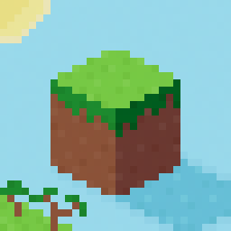

# MyCraft


- MyCraft is a Clone of Minecraft programed from scrach in **c++** and **OpenGL**. Its my First c++ project so any advices/help are welcome!

- Still WIP but you can Help!! [GitHub](https://github.com/PLSiorbpl/MyCraft)

- **Windows** And **Linux** Support!!

## 🎮 Controls
- ⬆️ To move forward use **"W"** Key
- ➡️ To move Right use **"D"** Key
- ⬅️ To move Left use **"A"** Key
- ⬇️ To move Back use **"S"** Key
- ⤴️ To Jump use **"SPACE"** Key
- 🔄 To Switch to Specator/Creative mode use **"1"**
- ⬆️ To move Up use **"E"** Key
- ⬇️ To move Down use **"CTRL"** Key

## ✨ Features!!
- 🔲 Infinite World Generation
- 🧱 Customizable Terrain (/MyCraft/Assets/Settings.txt)
- 📦 Efficient mesh generation
- 🎮 Game is Alredy Compiled (Windows And Linux (Arch at least))
- ⚙️ Settings (/MyCraft/Assets/Settings.txt)

## 🗂️ Project Structure
```bash 
.
├── MyCraft/
|   ├── Assets/     # Settings and textures
|   ├── Include/    # All necesary Libraries and compiled ImGui
|   ├── Lib/        # Idk why its a thing
|   ├── shaders/    # GLSL Shaders
|   └── src/        # C++ Source Files
|
├── imgui.ini
├── make.bat    # This is for Compilation (you need g++ compiler)
├── MyCraft.exe # Game
└── README.md   # You are reading this xd
```

## ⛓️‍💥 Build Instructions
- Get VS Code (I like just it)
- Get g++ compiler (MinGW)
- You need c++ extension too (in VS Code)
- Edit include Path (if its not detecting Include's)
- Run make.bat file and it should work
- You can also compile it with CMake but idk how
### 🔩 Recomended Include Path
- ${workspaceFolder}/**
- ${workspaceFolder}/MyCraft/Include/**
- ${workspaceFolder}/MyCraft/Include/glm/**
- ${workspaceFolder}/MyCraft/**

## ⚠️ Troubleshooting
- If you encounter any issues while compiling or running the game, feel free to **open an issue** on [GitHub](https://github.com/PLSiorbpl/MyCraft/issues)

## 👨‍💻 Author
- **PLSiorbpl**
- **ORE** Comunity also Helped me with **bugs** and **learning** c++
### 💬 Contact
- Discord: kopalnia4322
- GitHub: @PLSiorbpl | [My GitHub](https://github.com/PLSiorbpl)