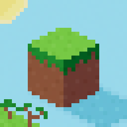
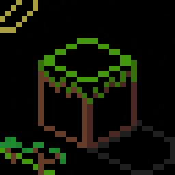

# MyCraft
 

- MyCraft is a Clone of Minecraft programed from scratch in **C++** and **OpenGL**. It's my First C++ project that means I still learn and code is a mess sometimes!

- Still in Development, but you can Help!! [GitHub](https://github.com/PLSiorbpl/MyCraft)

- **Windows** And *sometimes* **Linux** Support!!

## Controls
-  Movement: **WASD** Keys
-  Jump: **"SPACE"** Key
-  Game mode Spectator/Creative: **"1"** key
-  Fly Up: **"E"** Key
-  Fly Down: **"CTRL"** Key
-  Menu: **"ESCAPE"** Key
-  HotBar: **"Scroll Wheel"** on Mouse
-  Place/Break: **"Mouse"** Buttons
-  Debug view: **"F3"** Key
-  Health: **"TAB"** Key

## Features
-  **Infinite** World Generation
-  **Customizable** Terrain (/MyCraft/Assets/Settings.txt)
-  Efficient mesh generation
-  Cool Gui System
-  Game is already **Compiled** (**Windows** and *sometimes **Linux***)
-  In-game Settings menu
-  ~~Easy to use Multiplayer (currently only chat)~~ (in progress)
-  **Bloom effect** (can be *customized* in Settings file)

## Project Structure
```bash 
.
├── MyCraft/
|   ├── Assets/     # Settings and textures
|   ├── Include/    # All necesary Libraries
|   ├── Lib/        # Linux .dlls
|   ├── shaders/    # GLSL Shaders
|   └── src/        # C++ Source/Header Files
|
├── CmakeLists.txt  # Cmake
├── MyCraft.exe # Game
└── README.md   # You are reading this xd
```

## Build
-  You can compile game with **CMake**, **cmakelists.txt** is included

## Troubleshooting
- If you encounter any issues while compiling or playing the game, feel free to **open an issue** on [GitHub](https://github.com/PLSiorbpl/MyCraft/issues)

## Author
- **PLSiorbpl**
- **ORE** community also Helped me with **bugs** and **learning** c++
### Contact
- Discord: kopalnia4322
- GitHub: @PLSiorbpl | [My GitHub](https://github.com/PLSiorbpl)
