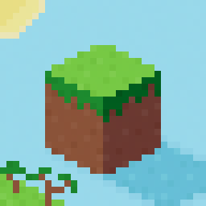
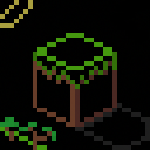

# MyCraft
 

- MyCraft is a Clone of Minecraft programed from scratch in **C++** and **OpenGL**. It's my First C++ project that means I still learn and code is a mess sometimes!

- Still in Development, but you can Help!! [GitHub](https://github.com/PLSiorbpl/MyCraft)

- **Windows** And *sometimes* **Linux** Support!!

## Controls
-  Movement: **WASD** Keys
-  Jump: **"SPACE"** Key
-  Game mode Spectator/Creative: **"1"** key
-  Fly Up: **"SPACE"** Key
-  Fly Down: **"CTRL"** Key
-  Menu: **"ESCAPE"** Key
-  HotBar: **"Scroll Wheel"** on Mouse
-  Place/Break: **"Mouse"** Buttons
-  Debug view: **"F3"** Key
-  Health: **"TAB"** Key
-  Inventory **"E""**

## Features
-  **Infinite** World Generation
-  Redstone
-  Placing/Breaking
-  Threaded mesh generation
-  Threaded terrain generation
-  Cool Gui System
-  In-game Settings
-  ~~Easy to use Multiplayer (currently only chat)~~ (in progress)
-  **Cool** shaders easy to change

## Project Structure
```bash 
.
├── MyCraft/
|   ├── Assets/     # Settings and textures
|   ├── Include/    # All necesary Libraries
|   ├── Lib/        # Linux .dlls
|   ├── shaders/    # GLSL Shaders
|   └── src/        # C++ Source/Header Files
|
├── CmakeLists.txt  # Cmake
├── MyCraft.exe # Game
└── README.md   # You are reading this xd
```

## Building
-  You can compile game yourself with **CMake, Ninja, g++/gcc** (should work with clang/msvc but needs some changes)
```bash
mkdir build
cd build
cmake -G Ninja ..
ninja
#NOTE MyCraft.exe needs to be folder up from /build/
```

## Troubleshooting
- If you encounter any issues while compiling or playing the game, feel free to **open an issue** on [GitHub](https://github.com/PLSiorbpl/MyCraft/issues)

## Author
- **PLSiorbpl**
- **ORE** community also Helped me with **bugs** and **learning** c++
### Contact
- Discord: kopalnia4322
- GitHub: @PLSiorbpl | [My GitHub](https://github.com/PLSiorbpl)
